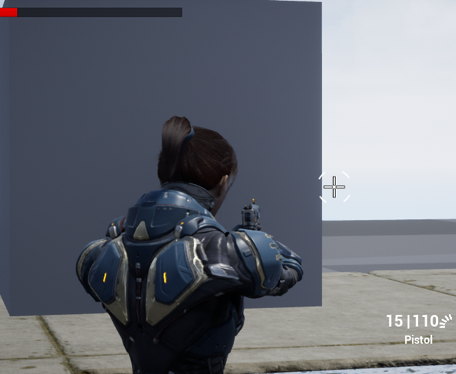

# Shooter_Project

Developed with Unreal Engine 4.27 

<h1 align="center">Привет! Меня зовут Алексей и это первый мой проект на Unreal Engine
</h1>
<h2 align="left">Что мне удалось реализовать в этом проекте?</h2>
<ul>
<li>Прицеливание  
</li>
</ul>