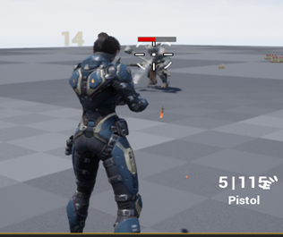
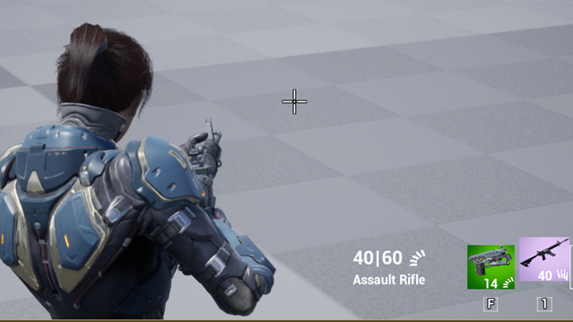
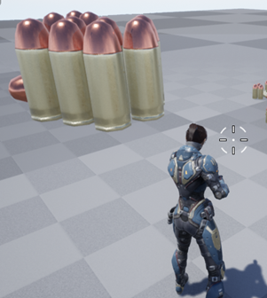
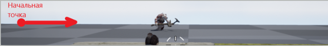

# Shooter_Project

Developed with Unreal Engine 4.27 

<h1 align="center">Привет! Меня зовут Алексей и это первый мой проект на Unreal Engine
</h1>
<h2 align="left">Что мне удалось реализовать в этом проекте?</h2>
<ul>
    <li>Прицеливание  </li>
        

            
        

    <li>Стрельба  </li>
        

            
        

    <li>Подбор оружия  </li>
        

            
        

    <li>Редкость предметов  </li>
        

            
        

    <li>Нанесение урона с виджетом отображения  </li>
        

            
        

    <li>Виджет здоровья противника  </li>
        

            
        

    <li>Виджет здоровя персонажа  </li>
        

            
        

    <li> Инвентарь  </li>
        

            
        

    <li> Аммуниция  </li>
        

            
        

    <li> Патрулирование точек противником  </li>
        

            
        

    <li> Атака противником  </li>
        

            
        

    <li> Смерть противника  </li>
        

            
        

    <li> Смерть персонажа  </li>
        

            
        
      
</ul>
<article>
Это лишь часть того, что было реализовано потому что можно бесконечно много и долго перечислять то, что было сделано.
Проект был реализован на связке С++ с Blueprint.
</article>